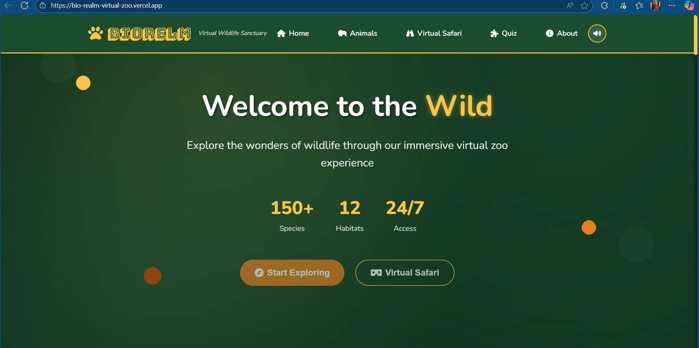

#  BioRealm - Virtual Wildlife Educational Platform



An immersive web-based platform that revolutionizes wildlife education through interactive virtual experiences, 3D holograms, and 360° safari tours.

##  Live Demo

[](https://bio-realm-virtual-zoo.vercel.app)
[](https://deeshamitra03.github.io/BioRealm-Virtual-zoo/)

## 📖 Table of Contents

- [Features](#-features)
- [Screenshots](#-screenshots)
- [Installation](#-installation)
- [Usage](#-usage)
- [Technology Stack](#-technology-stack)
- [Project Structure](#-project-structure)
- [Contributing](#-contributing)
- [License](#-license)
- [Acknowledgements](#-acknowledgements)

## ✨ Features

### 🦁 Interactive Animal Profiles
- **Detailed Information**: Comprehensive data on 60+ animal species
- **Conservation Status**: Real-time IUCN status tracking
- **Holographic Displays**: 3D animal models with interactive controls
- **Audio Integration**: Authentic animal sounds and calls

### 🗺️ Habitat Exploration
- **Interactive Maps**: Geographic distribution visualization using Leaflet.js
- **Region-based Filtering**: Explore animals by habitat and location
- **Habitat Information**: Detailed ecosystem descriptions

### 🎮 Immersive Experiences
- **360° Virtual Tours**: Explore jungles, savannas, and arctic environments
- **Interactive Quizzes**: Test your wildlife knowledge
- **Gamified Learning**: Earn achievements and track progress

### 🎨 Modern Design
- **Responsive Layout**: Works seamlessly on all devices
- **Jungle Theme**: Immersive visual design with natural colors
- **Smooth Animations**: GSAP-powered transitions and effects
- **Accessibility**: WCAG compliant design principles

## 📸 Screenshots

| Animal Gallery | Hologram View | Virtual Tour |
|----------------|---------------|--------------|
|  |  |  |

| Interactive Quiz | Habitat Map | Responsive Design |
|------------------|-------------|-------------------|
|  |  |  |

## 🛠️ Installation

### Prerequisites
- Modern web browser (Chrome, Firefox, Safari, Edge)
- Local server for development (optional)

### Quick Start
1. **Clone the repository**
   ```bash
   git clone https://github.com/Deeshamitra03/BioRealm-Virtual-zoo.git
   cd BioRealm-Virtual-zoo